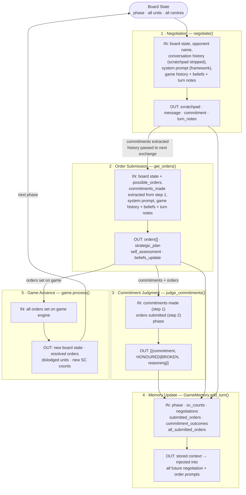

# Diplomacy Agent — Turn Flow

```mermaid
flowchart TD

    BOARD(["Board State\nphase · all units · all centres"])

    subgraph NEG ["1 · Negotiation  —  negotiate()"]
        N_IN["IN: board state, opponent name,\nconversation history (scratchpad stripped),\nsystem prompt (framework),\ngame history + beliefs + turn notes"]
        N_OUT["OUT: scratchpad · message · commitment · turn_notes"]
    end

    subgraph ORD ["2 · Order Submission  —  get_orders()"]
        O_IN["IN: board state + possible_orders,\ncommitments_made extracted from step 1,\nsystem prompt, game history + beliefs + turn notes"]
        O_OUT["OUT: orders[] · strategic_plan\nself_assessment · beliefs_update"]
    end

    subgraph JUD ["3 · Commitment Judgment  —  judge_commitments()"]
        J_IN["IN: commitments made (step 1)\norders submitted (step 2)\nphase"]
        J_OUT["OUT: [{commitment, HONOURED|BROKEN, reasoning}]"]
    end

    subgraph MEM ["4 · Memory Update  —  GameMemory.add_turn()"]
        M_IN["IN: phase · sc_counts · negotiations\nsubmitted_orders · commitment_outcomes\nall_submitted_orders"]
        M_OUT["OUT: stored context → injected into\nall future negotiation + order prompts"]
    end

    subgraph ADV ["5 · Game Advance  —  game.process()"]
        A_IN["IN: all orders set on game engine"]
        A_OUT["OUT: new board state · resolved orders\ndislodged units · new SC counts"]
    end

    BOARD --> N_IN
    N_IN --> N_OUT
    N_OUT -->|"commitments extracted\nhistory passed to next exchange"| O_IN
    O_IN --> O_OUT
    O_OUT -->|"commitments + orders"| J_IN
    J_IN --> J_OUT
    J_OUT --> M_IN
    O_OUT --> M_IN
    N_OUT --> M_IN
    M_IN --> M_OUT
    O_OUT -->|"orders set on game"| A_IN
    A_IN --> A_OUT
    A_OUT -->|"next phase"| BOARD
```
